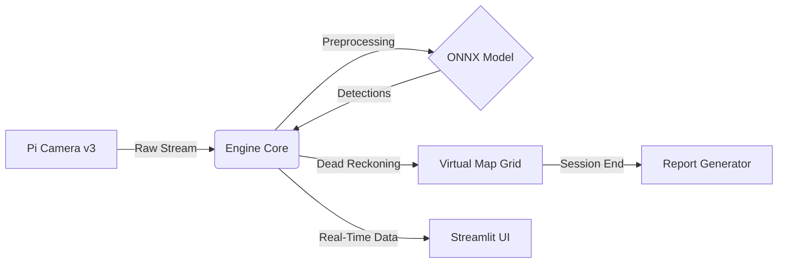

# 🗺️ TrashMapper V2  
### Next-Gen Edge AI Waste Detection & Mapping System

**TrashMapper V2** is a next-generation, ultra-lightweight, high-performance **edge AI platform** designed for **real-time waste detection and virtual mapping** on **Raspberry Pi 5** with **Camera Module v3**.

Unlike legacy, over-engineered architectures, TrashMapper V2 follows a **Monolithic Micro-Kernel design**, running **Camera, AI Inference, Mapping, and Reporting** inside a single optimized engine.

📌 **No GPS required**  
📌 **Dead Reckoning–based virtual mapping**  
📌 **Fully offline & edge-native AI**

---

## 📸 Screenshots

| Live Analysis Dashboard | Generated Heatmap Report |
|:---:|:---:|
|  |

---

## 🚀 Key Features

### ⚡ Ultra-Optimized Engine

- **Raspberry Pi 5 Ready**  
  Optimized ONNX Runtime pipeline tailored for Pi 5 CPU/NPU architecture.

- **Minimalist Codebase**  
  Single optimized backend engine instead of fragmented multi-module systems.

- **High FPS Performance**  
  Smooth real-time inference at 640px resolution on edge hardware.

---

### 🧠 Advanced AI Vision

- **60+ Waste Classes**  
  YOLO model trained on the **TACO dataset**  
  (plastic, metal, glass, cigarette butts, paper, etc.)

- **Smart Object Tracking**  
  Lightweight ID-based tracking to prevent duplicate counts.

- **Auto-Focus Logic**  
  Continuous PDAF autofocus integration for Pi Camera v3.

---

### 📍 GPS-Free Mapping (Dead Reckoning)

- No external GPS module required.

- **Virtual Odometry**  
  Estimates movement based on walking speed and camera orientation.

- **Relative Position Estimation**  
  Detected waste is mapped using camera angle and depth approximation.

---

### 📊 Automated Intelligence

- **One-Click Reporting**  
  Automatically generates report-ready visual outputs at session end.

- **Heatmap Generation**  
  Visualizes waste density across scanned areas.

- **Actionable Insights**  
  Rule-based recommendations such as:  
  *“High cigarette density detected — consider adding ashtrays.”*

---

## 🏗️ Architecture

The system is intentionally simplified for maximum performance and reliability:



## 📂 Project Structure

* No unnecessary complexity. Only files that actually matter:

```mermaid
trashmapper/
├── config.yaml        # All system configuration (Camera, AI, Mapping)
├── backend.py         # Core engine (AI, Camera, Math, Tracking)
├── app.py             # Streamlit user interface
├── run.sh             # One-click install & launch
└── models/
    └── best.onnx      # Trained YOLO model
```

---

## ⚙️ Installation

# 📌 Hardware Requirements

- Board: Raspberry Pi 5 (4GB or 8GB)
- Camera: Raspberry Pi Camera Module v3 (Standard or Wide)
- OS: Raspberry Pi OS 64-bit (Bookworm)

---

## 🔧 Quick Setup

* Open a terminal and run:

```bash
git clone https://github.com/burakdevelopment/trashmapper.git
cd trashmapper

#place your trained model into the models folder
# models/best.onnx

chmod +x run.sh
./run.sh
```

* After setup, the browser will open automatically:
- 👉 http://localhost:8501

---

## ▶️ How to Use

1. Start Session
- Select Session / Mapping Mode and click 🚀 START.

2. Scan Environment
- Walk naturally while holding the device.
- The system assumes forward motion and builds a virtual map.

3. Monitor Live Data
- View real-time FPS, detections, counters, and bounding boxes.

4. Finish & Report
- Click 🛑 STOP & GENERATE REPORT.

* Analyze Outputs
- A session folder is generated containing:

- heatmap.png — waste density heatmap
- histogram.png — waste type distribution
- report.json — detailed analysis & recommendations

---

## 🔧 Configuration (config.yaml)

- Customize behavior without touching the code:

```bash
camera:
  type: "picamera2"     # or "opencv" for USB cameras
  width: 1280
  height: 720

ai:
  conf_thres: 0.25
  model_path: "models/best.onnx"

mapping:
  grid_size_meter: 100
  virtual_speed: 1.0   # walking speed (m/s)
  ```

---

## 📜 License

**This project is open-source under the MIT License.**

---

## ✨ Author

* Burak Akpınar
